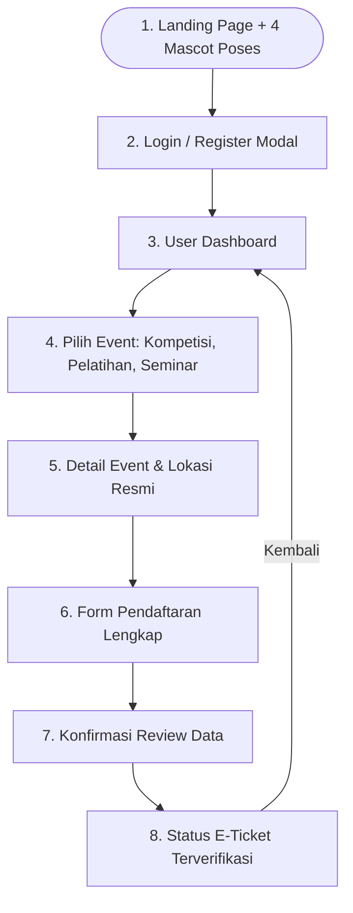

# DOKUMEN SPESIFIKASI FINAL & MASTER PROMPT CODEX: IT-FESTIVAL 2026

Dokumen ini disusun berdasarkan analisis mendalam terhadap source code asli 4 halaman (Home, Kompetisi, Pelatihan, dan Seminar) dari **IT-Festival 2026 Politeknik Negeri Sriwijaya (POLSRI)**, digabungkan dengan arsitektur pendaftaran 8 tahap, 4 slot maskot resmi (Belibit), dan integrasi alamat sekretariat.

---

## 1. DATA RESMI DARI SOURCE CODE ASLI (VERIFIKASI 100%)

### 1.1 Informasi Identitas & Kontak
* **Nama Acara:** IT-FESTIVAL 2026
* **Penyelenggara:** Jurusan Manajemen Informatika, Politeknik Negeri Sriwijaya (POLSRI)
* **Tagline:** "Festival teknologi terbesar 2026 yang menghadirkan kompetisi, pelatihan, dan seminar untuk talenta digital masa depan."
* **Alamat Resmi:**  
  `Jl. Srijaya Negara, Bukit Lama, Kec. Ilir Bar. I, Kota Palembang, Sumatera Selatan 30128`
* **Email Resmi:** `itfestivalpolsri2026@gmail.com`
* **WhatsApp:** `08822-7984-0310` & `08838-1925-5395`
* **Instagram:** `@itfestival.polsri`

---

### 1.2 Data Cabang Kompetisi Resmi (5 Cabang)
1. **Mobile Legends (MLBB):**
   * *Deskripsi:* "Buktikan skill dan kerja sama timmu di arena Mobile Legends, raih kemenangan demi kemenangan."
   * *Jadwal:* Sabtu, 3 Oktober 2026 (Online) – Minggu, 4 Oktober 2026 (Offline di Kampus POLSRI).
   * *Technical Meeting:* Jum’at, 2 Oktober 2026.
2. **Free Fire (FF):**
   * *Deskripsi:* "Turun ke medan pertempuran Free Fire, jadi yang terakhir bertahan dan raih Booyah!"
   * *Jadwal:* Sabtu, 10 Oktober 2026 (Online) – Minggu, 11 Oktober 2026 (Offline di Kampus POLSRI).
   * *Technical Meeting:* Jum’at, 9 Oktober 2026.
3. **Vibe Coding Competition:**
   * *Deskripsi:* "Bangun aplikasi atau produk digital secepat mungkin menggunakan bantuan AI, untuk menciptakan kreativitas."
   * *Jadwal Pengumpulan:* 12 Oktober – 23 Oktober 2026.
   * *Penjurian:* 24 – 30 Oktober 2026.
4. **Capture The Flag (CTF) Competition:**
   * *Deskripsi:* "Uji kemampuan hacking dan keamanan sibermu dengan memecahkan berbagai tantangan CTF dari level pemula hingga expert."
   * *Jadwal Pelaksanaan:* Sabtu, 17 Oktober 2026.
5. **Photography Competition:**
   * *Deskripsi:* "Tunjukkan sudut pandang kreatifmu lewat lensa kamera dan abadikan momen terbaik dalam kompetisi fotografi ini."
   * *Jadwal Pengumpulan:* 12 Oktober – 23 Oktober 2026.

---

### 1.3 Data Cabang Pelatihan Resmi (2 Workshop)
1. **Pelatihan Vibe Coding:**
   * *Deskripsi:* "Belajar membangun aplikasi dan produk digital secara cepat dengan bantuan AI, dari ide sampai jadi produk nyata."
   * *Jadwal:* 17–18 September & 21–22 September 2026.
2. **Pelatihan Cyber Security:**
   * *Deskripsi:* "Pelajari dasar-dasar keamanan siber, mulai dari deteksi celah keamanan hingga teknik perlindungan sistem."
   * *Jadwal:* 23–25 September & 28 September 2026.
* *Link Feedback Pelatihan:* `https://bit.ly/FeedbackPelatihanITFestival2026`

---

### 1.4 Data Pembicara Seminar Nasional
1. **Avip Syaifulloh, S.T.** (Guest Star)
   * *Jabatan:* CEO WPU Course
   * *Materi:* Roadmap Industri Software Engineering & Karir Digital
   * *Tautan CV:* `/speakers/cv-avip-syaifulloh.pdf`
2. **Rahmi Liza, S.Tr.Kom., M.Sc.** (Speaker)
   * *Jabatan:* Software Engineer
   * *Materi:* Rekayasa Perangkat Lunak Modern & AI Terapan
   * *Tautan CV:* `/speakers/cv-rahmi-liza.pdf`
* *Tautan Pendaftaran Tiket Seminar:* `https://bit.ly/PendaftaranSeminarITFestival2026`
* *Tautan Feedback Seminar:* `https://bit.ly/FeedbackPesertaSeminarITFestival2026`

---

## 2. ARSITEKTUR USER JOURNEY 8 TAHAP (SPA + LOCALSTORAGE)



---

## 3. MASTER PROMPT LENGKAP UNTUK OPENAI CODEX

Salin blok prompt di bawah ini ke Codex:

```markdown
Role: Principal Creative Frontend Engineer & Cyberpunk UI Architect
Task: Build a complete, responsive Single Page Application (SPA) for "IT-FESTIVAL 2026" (Politeknik Negeri Sriwijaya - POLSRI Palembang) featuring a Neo-Brutalist 16-Bit Retro Pixel Art aesthetic. The system must incorporate authentic content from all 4 official pages (Home, Kompetisi, Pelatihan, Seminar), an 8-stage end-to-end registration flow, an official secretariat address, a 4-slot mascot showcase, and full state management powered by HTML5 LocalStorage and jQuery 3.7.1.

### 1. TECHNICAL STACK & CDN ASSETS:
- HTML5 (Single-file SPA architecture with dynamic view switching)
- Tailwind CSS v3 via CDN (https://cdn.tailwindcss.com) with custom neo-brutalist theme extensions
- jQuery 3.7.1 via CDN (https://code.jquery.com/jquery-3.7.1.min.js)
- Canvas-Confetti via CDN (https://cdn.jsdelivr.net/npm/canvas-confetti@1.9.3/dist/confetti.browser.min.js)
- Google Fonts: "Press Start 2P", "Pixelify Sans", "Space Mono"
- HTML5 Web Storage API (localStorage: 'itfest_users', 'itfest_currentUser', 'itfest_registrations')

### 2. DESIGN TOKENS & VISUAL SYSTEM (IDENTICAL TO OFFICIAL WEB):
- Background: Dark Navy #040612 and #070a1e with 36px subtle grid pattern.
- Cyber Palette:
  - Cyber Yellow: #FFE600
  - Neon Pink: #FF2E93
  - Electric Cyan: #00F0FF
  - Ink Border: #050718
  - Warm Cream: #F5F1E0
- Elevation & Borders: Solid 3px/4px #050718 on all cards, buttons, badges, and modals.
- Neo-Brutalist Hard Shadows: box-shadow: 5px 5px 0px #050718 with ZERO blur.
- Button Mechanics: Active state triggers translate(3px, 3px) with reduced shadow.
- Ambient Elements: Large blurred glowing colored orbs (pink, cyan, yellow) and tilted floating retro badges.

### 3. OFFICIAL METADATA & SECRETARIAT ADDRESS:
- Host: Jurusan Manajemen Informatika, Politeknik Negeri Sriwijaya (POLSRI)
- Official Address: "Jl. Srijaya Negara, Bukit Lama, Kec. Ilir Bar. I, Kota Palembang, Sumatera Selatan 30128"
- Email: itfestivalpolsri2026@gmail.com
- Contact: 08822-7984-0310 / 08838-1925-5395
- Instagram: @itfestival.polsri

### 4. OFFICIAL EVENT DATA INTEGRATION (FROM REAL SOURCE CODE):
A. KOMPETISI (5 Events):
   1. Mobile Legends (Online: 3 Okt 2026 | Offline Final: 4 Okt 2026 at POLSRI | TM: 2 Okt 2026)
   2. Free Fire (Online: 10 Okt 2026 | Offline Final: 11 Okt 2026 at POLSRI | TM: 9 Okt 2026)
   3. Vibe Coding Competition (AI-Assisted App Development | Submission: 12-23 Okt 2026 | Penjurian: 24-30 Okt 2026)
   4. Capture The Flag (CTF) Competition (Jeopardy Hacking: Web, Crypto, Forensics, Reverse Eng, Pwn | Date: 17 Okt 2026)
   5. Photography Competition (Theme: Human & Technology | Submission: 12-23 Okt 2026)
   - Timeline Kompetisi: Pendaftaran (10 Agu – 11 Okt 2026), Pengumpulan (12–23 Okt), TM (2 & 12 Okt), Penjurian (3–30 Okt), Pengumuman (2 Nov 2026).

B. PELATIHAN (2 Tracks):
   1. Pelatihan Vibe Coding (Hands-on AI-driven product creation | Dates: 17-18 & 21-22 Sept 2026)
   2. Pelatihan Cyber Security (OWASP Top 10, pentesting, network analysis | Dates: 23-25 & 28 Sept 2026)
   - Feedback Link: https://bit.ly/FeedbackPelatihanITFestival2026

C. SEMINAR NASIONAL (16 September 2026):
   - Guest Star: Avip Syaifulloh, S.T. (CEO WPU Course)
   - Keynote Speaker: Rahmi Liza, S.Tr.Kom., M.Sc. (Software Engineer)
   - Registration Link: https://bit.ly/PendaftaranSeminarITFestival2026
   - Feedback Link: https://bit.ly/FeedbackPesertaSeminarITFestival2026

### 5. MASCOT SHOWCASE (4 POSES):
Provide a dedicated 4-card gallery on the landing page for the mascot (Belibit - Cyber Belida Palembang):
- Slot 1 (#mascot-img-1): Default Idle Pose
- Slot 2 (#mascot-img-2): Cyber Coder / Hacker Pose
- Slot 3 (#mascot-img-3): Champion Trophy Pose
- Slot 4 (#mascot-img-4): Retro Gamer Chibi Pose

### 6. COMPLETE 8-STAGE USER JOURNEY (SPA ROUTING):
1. Page Landing (#view-landing): Hero typewriter, countdown timer (Days, Hours, Min, Sec), 4-slot mascot gallery, and flow roadmap.
2. Login / Register Modal (#auth-modal): Tabbed modal authentication saving accounts to localStorage ('itfest_users') and session to 'itfest_currentUser'. Navbar updates dynamically.
3. User Dashboard (#view-dashboard): Personalized greeting, count of enrolled events, active ticket list, and "+ Daftar Event Lain" CTA.
4. Pilih Event (#view-events): Filterable catalog tabs (All, Kompetisi, Pelatihan, Seminar) rendering the 9 events/speakers.
5. Detail Event (#view-event-detail): Full specification (Rulebook, prize pool, date, venue address) with login guard.
6. Form Pendaftaran (#view-form-pendaftaran): Collects Leader Name, Email, WhatsApp, Institution, Team Name, and ID/KTM link.
7. Konfirmasi (#view-konfirmasi): Pre-flight review table displaying all details and terms consent.
8. Status & E-Ticket (#view-status): Retro dashed-border ticket pass with unique code (ITFEST-2026-XXXX), verified badge, dummy barcode lines, and window.print() action, triggering confetti.

### DELIVERABLE:
A single, complete, production-ready standalone index.html file with zero omitted scripts or placeholders.
```
